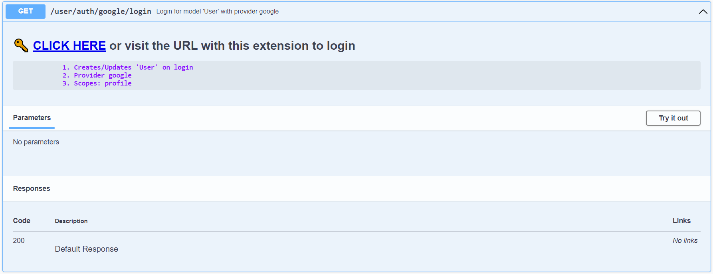

# Authenticating Users

## Creating the User

EzBackend automatically provides the following:
1. Login Page
1. Logout route
1. Federated Auth Provider
1. Saving Users to Database

in `2 lines` of code

```ts {5-7}
import {EzUser, EzAuth} from '@ezbackend/auth'

const app = new EzBackend()

app.addApp('ez-auth', new EzAuth())

const user = new EzUser('User',['google'],{})

app.addApp('User',user,{prefix:'user'})

app.start()
```

Breaking it down:

```ts
const user = new EzUser('User',...)
```

EzUser is a child of EzModel, and thus the user will be stored in the database as `User`

```ts
const user = new EzUser(...,['google'],...)
```

An array of providers that you wish to use. Different providers may require you to set different configuration variables.

```bash
GOOGLE_CLIENT_ID=xxx.apps.googleusercontent.com
GOOGLE_CLIENT_SECRET=yyyy-zzzzzzzzzzzzzzz
BACKEND_URL=http://localhost:8000
```

You can get your google client id and secret following the instructions [here](https://developers.google.com/adwords/api/docs/guides/authentication#webapp) (Even though it is the AdWords API the instructions should be the same)

:::info
You also need to add the callback URI to the OAuth2 settings
:::

:::caution
Environment variables are automatically loaded by EzBackend
:::

For example, setting up the google provider requires you to set the above environment variables

<!-- TODO: Consider if loading environment variables automatically is a good idea (consider load order as well) -->

```ts
app.addApp('User',user,{prefix:'user'})
```

`User` - purely visual name of the App

`prefix:user` - All of the user routes are under the prefix `user`

## Logging in

### Testing

You can test the login from the automatically [generated documentation](http://localhost:8000/docs/static/index.html#/default/get_user_auth_google_login)

In the generated documentation, you should see something like


:::info
You need to have the openapi plugin and db-ui plugins for this to work
:::

### Frontend

On the frontend, when the user logs in you can use login url as either
<!-- TODO: Check if the popup method really works -->
1. A popup
1. A redirect

In addition, you will have to update the auth config to redirect to your frontend page

```ts
app.start({
    auth: {
        google: {
            successRedirectURL: "https://<YOUR FRONTEND SUCCESS URL>",
            failureRedirectURL: "https://<YOUR FRONTEND FAILURE URL>"
        }
    }
})
```

## Logging out

### Testing

You can test the logout from the automatically [generated documentation](http://localhost:8000/docs/static/index.html#/default/get_user_auth_google_logout)


### Frontend

On the frontend, when the user needs to be logged out, redirect the user to the logout route to log them out

<!-- TODO: Code examples for frontend -->

## Adding metadata

Different users will probably have different roles within the application. For example, assuming a user can be a premium user, admin user or on the free tier:

```ts
const app = new EzBackend()

app.addApp('ez-auth', new EzAuth())

const user = new EzUser('User', ['google'], {
    isAdmin: { //GOOD
        type: Type.BOOL,
        default: false
    },
    isPremium: { //GOOD
        type: Type.BOOL,
        nullable: true
    },
    isFreeTier: Type.BOOL //BAD
})

app.addApp('User',user,{prefix:'user'})

app.start()
```

For the EzUser, you must specify either
1. A default value
1. That the field is nullable

This is because when a user logs in, if the field is not specified, TypeORM does not know what to put in the field and thus throws an error.

:::info

This applies for relations on EzUser as well

:::

<!-- TODO: Create test cases for relations on EzUser -->